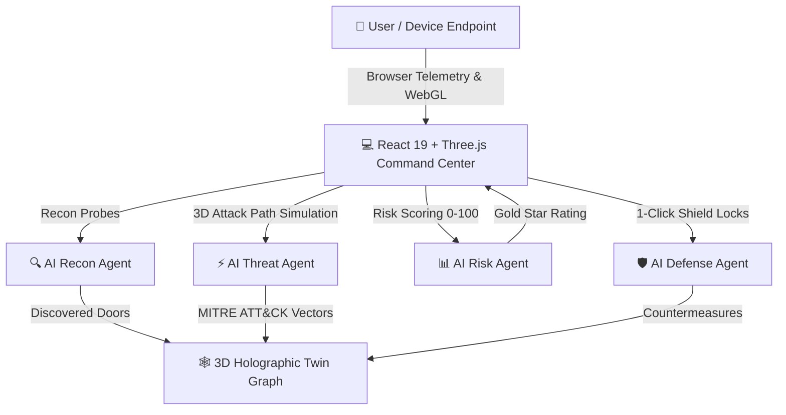

# 🛡️ AI Digital Twin Security Agent (TwinAgent AI)

<p align="center">
  
  
  
  
  
</p>

<p align="center">
  <strong>An Intelligent Autonomous Cybersecurity Digital Twin Platform featuring 3D Holographic Graph Modeling, Plain English Kid-Friendly Story Mode, and Real-Time Hardware & Network Telemetry.</strong>
</p>

<p align="center">
  🌐 <strong>Live Production URL:</strong> <a href="https://ai-digital-twin-security-agent.vercel.app" target="_blank">https://ai-digital-twin-security-agent.vercel.app</a>
</p>

---

## 🌟 Executive Overview

**AI Digital Twin Security Agent** creates a zero-risk, high-fidelity virtual clone (Digital Twin) of an organization's or personal device's attack surface. Instead of running hazardous live penetration tests against critical production hardware, our autonomous multi-agent engine:
1. **Discovers Digital Doors & Network Sockets** without disrupting active processes.
2. **Simulates Adversary Attack Paths & MITRE ATT&CK Tactics** inside an isolated sandbox graph.
3. **Calculates Quantitative Multi-Factor Risk & Gold Star Health Scores** in real time.
4. **Applies 1-Click Defensive Shield Locks** with instant countermeasure verification.
5. **Presents Everything in Dual Mode**: Advanced cybersecurity telemetry for security engineers, and intuitive, friendly metaphors that a young child can immediately understand.

---

## 🚀 Key Innovations & Superpowers

### 🤖 1. Dual Persona: Kid-Friendly & Enterprise Modes
- **Safe Robot Twin 🤖**: Explains complex cybersecurity concepts through playful, relatable analogies (Digital Doors, Sneaky Bad Guys, Super Shield Padlocks, and Gold Star Safety Scores).
- **Zero Blue Palette**: Warm, accessible visual design built entirely with Emerald Green (`#10b981`), Royal Purple (`#a855f7`), Sunny Amber (`#fbbf24`), and Coral Rose (`#f43f5e`).
- **Permanently Built-In Plain English**: Eliminates confusing switches or toggles—every vulnerability includes a 1-sentence plain English translation and an easy fix.

### 🩺 2. Whole Computer & Phone Health Checkup
- **Deep WebGL Hardware Fingerprinting**: Inspects GPU render engine, CPU concurrency cores, RAM estimate, screen resolution, and battery state.
- **Sensor & Privacy Exposure Audit**: Checks browser permissions for camera, microphone, and geolocation.
- **Wi-Fi Radar & Latency Diagnostic**: Measures round-trip network response times and public IPv4 routing context.

### 🌐 3. 3D Holographic Interactive Command Center
- **Smooth 3D Topology Playground**: OrbitControls with dynamic group rotation, speed adjustments (0.2x to 2.0x), and pause/resume.
- **Dedicated Floating Zoom Controls**: `+`, `−`, and `Reset` camera buttons with interactive click-to-focus node inspection.
- **Animated Attack Vector Conduits**: Glowing laser conduits and moving energy packets demonstrating lateral attacker pivots in 3D space.

### ⚡ 4. Autonomous On-Device Twin Synthesizer
- **100% Offline & Firewall Resilient**: When scanning public IPs (like `152.59.201.253`) where mobile carrier NATs or firewalls block raw Nmap probes, the built-in browser engine autonomously synthesizes the twin, ensuring zero scan failures.

---

## 🏗️ System Architecture



---

## 🤖 The Autonomous Multi-Agent Hierarchy

| Agent | Responsibility | Core Mechanism |
|---|---|---|
| **🔍 Recon Agent** | Target Discovery | Automated socket sweeps, banner analysis, and browser endpoint diagnostics. |
| **⚡ Threat Agent** | Adversary Modeling | MITRE ATT&CK mapping (T1190, T1040, T1021, T1530) and multi-hop lateral pivot simulation. |
| **📊 Risk Agent** | Health Assessment | CVSS base weighting, exposure multipliers, attack path depth, and Gold Star Score (0-100). |
| **🛡️ Defense Agent** | Hardening & Padlocks | Aligned with CIS Controls v8 and NIST SP 800-53 with 1-click simulated remediation. |

---

## 🛠️ Technology Stack

* **Frontend**: React 19, Vite, Tailwind CSS v4, Framer Motion, Lucide Icons
* **3D Visualization**: Three.js, `@react-three/fiber`, `@react-three/drei`
* **Audio Synthesis**: Web Audio API Sound Generator (No external MP3 files needed)
* **Backend Services**: Python 3.11, FastAPI, Uvicorn, SQLite/PostgreSQL, Neo4j, NetworkX
* **Deployment & CI/CD**: Vercel (Frontend), Render (API), GitHub Actions

---

## 🏃 Quick Start Guide

### Option A: Launch with Automated Script
```powershell
.\start_all.bat
```

### Option B: Manual Setup

1. **Clone the Repository**:
   ```bash
   git clone https://github.com/chennuhari/AI-Digital-Twin-Security-Agent.git
   cd AI-Digital-Twin-Security-Agent
   ```

2. **Start Backend (FastAPI)**:
   ```bash
   cd fastapi-backend
   pip install -r requirements.txt
   python -m uvicorn main:app --host 0.0.0.0 --port 8001 --reload
   ```

3. **Start Frontend (Vite + React)**:
   ```bash
   cd ../frontend
   npm install
   npm run dev
   ```

4. **Open in Browser**:
   * Dashboard: `http://localhost:5173`
   * Swagger API Docs: `http://localhost:8001/docs`

---

## 📄 License
This project is open-source and available under the [MIT License](LICENSE).
